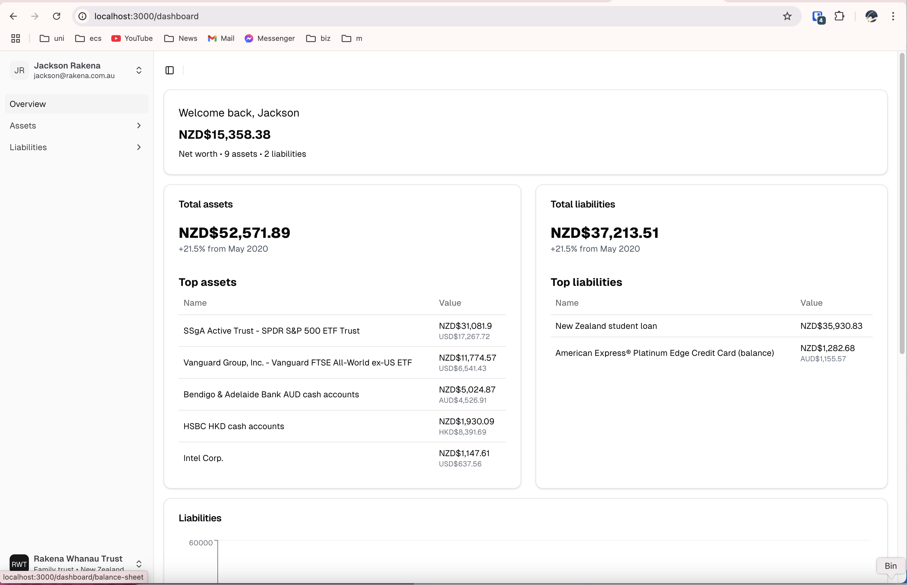

# mxbudget
An open-source, personal-use-first, **principled** financial analysis software.

### Principled?
Principled means the following:
1. Doesn't sell your data or move it anywhere else (obviously)
2. **Doesn't ask for your internet banking credentials.**
   1. Competing budget/net worth tracking software in the Australia/New Zealand markets - like [WeMoney](https://www.wemoney.com.au/) - ask for your log on credentials to your internet banking (Westpac, NAB, Commonwealth Bank, etc), and then log in as you to pull your account information to show in the app.
   2. Not only is this dangerous - but it [violates your bank's terms & conditions](https://www.consumer.org.nz/articles/poli-payments-how-it-affects-and-breaches-your-banking-security), leaving you open to possible consequences.
   3. Additionally, these services aren't upfront about this behaviour. Some of them impersonate your bank's login page, and don't say anywhere that they're recording your banking credentials.

### Architecture

### Design goals
* Automation - use open banking APIs, if possible
  * These are often hard to access. New Zealand's banking industry has made small steps towards a Europe-style model, but it's still limited, often broken, and expensive to access.
  * The tedious alternative - manual entry - must be a pleasant user interface and easy to do
* Asset tracking:
  * Live/regular automated update of stocks, shares, equities
    * [ ] NYSE, ARCA, NASDAQ
    * [ ] ASX, NZX
    * [ ] Future: European/Asian markets
  * Cash accounts, with solid, automated tracking of fluctuations in currency exchange rates
    * Daily ledger entry of the FX rate for the day
    * Multi-currency view, with a default 'home currency' (in the screenshot below, this is NZD New Zealand Dollar)
* Liability tracking:
  * Mortgage/property assets
    * While most likely manual entry (house price modelling is complicated), the interface should be pleasant and with helpful mortgage features
  * Student loans
    * New Zealand (StudyLink/IRD)
      * Show whether person will begin interest-bearing period
    * Australia (HECS/HELP)
      * Indexation calculator/projections
### Screenshots
Still heavily in-development, but asset object tracking, as well as ledger entries (how assets change in valuation over time) is implemented.

### Copyright
&copy; 2025 Jackson Rakena, MIT License